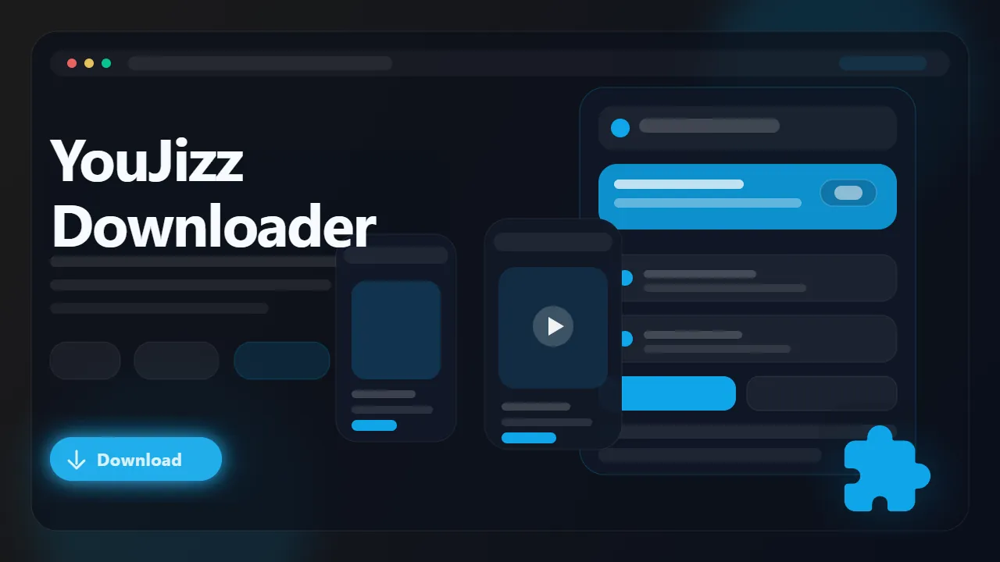

# YouJizz Downloader (Browser Extension)

> Download supported YouJizz videos as MP4 files directly from watch pages in your browser.

YouJizz Downloader is a browser extension built for users who want a cleaner way to save supported YouJizz videos for offline viewing. It detects the active media source on the page, surfaces available quality options when present, and exports the final file as MP4 without forcing you into manual URL extraction or command-line tooling.

- Save supported YouJizz videos from the browser
- Detect direct files and player-backed video streams
- Choose from available quality levels when exposed
- Export MP4 files for simpler playback and archiving
- Keep the workflow browser-native and repeatable

## Links

- :rocket: Get it here: [YouJizz Downloader](https://serp.ly/youjizz-downloader)
- :new: Latest release: [GitHub Releases](https://github.com/serpapps/youjizz-downloader/releases/latest)
- :question: Help center: [SERP Help](https://help.serp.co/en/)
- :beetle: Report bugs: [GitHub Issues](https://github.com/serpapps/youjizz-downloader/issues)
- :bulb: Request features: [Feature Requests](https://github.com/serpapps/youjizz-downloader/issues)

## Preview

## Table of Contents

- [Why YouJizz Downloader](#why-youjizz-downloader)
- [Features](#features)
- [How It Works](#how-it-works)
- [Step-by-Step Tutorial: How to Download Videos from YouJizz](#step-by-step-tutorial-how-to-download-videos-from-youjizz)
- [Supported Formats](#supported-formats)
- [Who It's For](#who-its-for)
- [Common Use Cases](#common-use-cases)
- [Trial & Access](#trial--access)
- [Troubleshooting](#troubleshooting)
- [Installation Instructions](#installation-instructions)
- [FAQ](#faq)
- [License](#license)
- [Notes](#notes)
- [About YouJizz](#about-youjizz)

## Why YouJizz Downloader

YouJizz pages can expose different playback sources depending on the page state, player config, and available encodings. Generic downloaders often grab the wrong asset, miss the real video source, or fail once the site serves multiple variants from the same page.

YouJizz Downloader is designed to simplify that. It uses multi-source detection to find streams from flashvars, HTML5 video elements, and media API endpoints. Start the video, let the extension detect the active media source, then export the supported stream as MP4 without leaving the browser.

## Features

- Detects supported YouJizz video sources from active pages
- Multi-source detection covering flashvars, HTML5 video, and media API
- In-page download button built into the video player
- Handles direct-file and supported player-backed download flows
- Converts HLS streams to standard MP4 files in-browser
- Lists available quality variants when multiple encodings exist
- Right-click context menu for quick downloads
- Exports MP4 files for easier offline playback
- Auto-saves to an organized YouJizz subfolder in Downloads
- Works on Chrome, Edge, Brave, Opera, Firefox, Whale, and Yandex

## How It Works

1. Install the extension from the latest release.
2. Open a YouJizz video page and press play.
3. Let the extension detect the active media source.
4. Open the popup or use the in-page download button on the player.
5. Select the quality you want from the available resolutions.
6. Start the download and wait for the MP4 export to finish.
7. Save the finished file locally.

## Step-by-Step Tutorial: How to Download Videos from YouJizz

1. Install YouJizz Downloader in your browser.
2. Open the YouJizz watch page for the video you want.
3. Start playback so the player loads the full media stream.
4. Click the in-page download button on the player, or open the extension popup.
5. Review the detected source and available quality options.
6. Choose the quality you want if multiple resolutions are shown.
7. Start the download and wait for the MP4 export to finish.
8. Open the saved file from your Downloads/YouJizz folder.

## Supported Formats

- Input: supported YouJizz video sources
- Output: MP4

Saved files use MP4 so they are easier to replay on standard media players, move between devices, or archive locally.

## Who It's For

- Users who want offline copies of supported YouJizz videos
- Viewers who prefer a browser extension over manual extraction
- People archiving videos they already have browser access to
- Users who want simple MP4 output for later playback
- Anyone organizing personal downloads into a cleaner local library

## Common Use Cases

- Save a supported YouJizz video for later
- Export a playable MP4 copy of a watch-page video
- Download the best quality exposed by the page
- Avoid digging through page scripts for video URLs
- Keep local offline copies for repeat viewing

## Trial & Access

- Includes **3 free downloads** so you can test the workflow first
- Email sign-in uses secure one-time password verification
- No credit card required for the trial
- Unlimited downloads are available with a paid license

Start here: [https://serp.ly/youjizz-downloader](https://serp.ly/youjizz-downloader)

## Troubleshooting

**The extension does not detect the video**  
Press play first and wait for the page to initialize the active source.

**Only one quality is listed**  
Some pages expose only one usable source, so no extra picker appears.

**The wrong source was detected**
Refresh the page, start playback again, and retry after the player fully loads.

**The download failed partway through**
Check your connection and refresh the page before starting again.

**The page requires account access**
The extension only works on media you can already open and play in your active browser session.

## Installation Instructions

1. Open the latest release page: [GitHub Releases](https://github.com/serpapps/youjizz-downloader/releases/latest)
2. Download the build for your browser.
3. Install the extension.
4. Open a YouJizz video page.
5. Use the popup to detect and download the media.

## FAQ

**Can I download YouJizz videos as MP4?**  
Yes. Supported downloads are exported as MP4 files.

**Do I need extra software?**  
No. The workflow stays inside the browser extension.

**Will it work on every page?**
It works on supported playback flows. Detection depends on how the page exposes the current media source.

**Where are videos saved?**
They are saved to your default Downloads location, typically inside a YouJizz subfolder.

**Is my data safe?**
Yes. Video processing happens entirely in your browser. Authentication uses secure OTP with no passwords stored.

## License

This repository is distributed under the proprietary SERP Apps license in the [LICENSE](LICENSE) file. Review that file before copying, modifying, or redistributing any part of this project.

## Notes

- Only download content you own or have explicit permission to save
- An internet connection is required for downloads
- Quality depends on the media source exposed by YouJizz
- Must press play before detection can begin

## About YouJizz

YouJizz is a video platform with multiple source variants and changing player states across pages. YouJizz Downloader is built to make supported downloads easier for users who already have access to that content in the browser.
